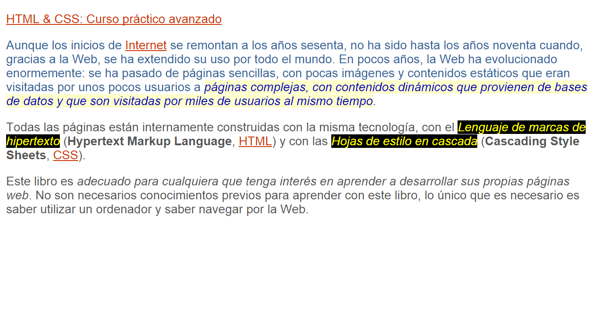
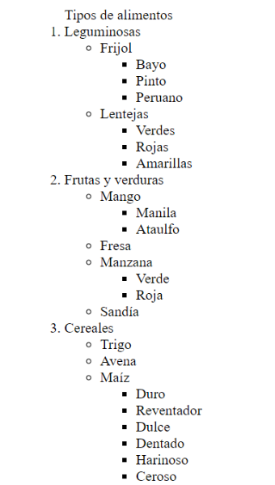

¡Hola!

Aquí tienes las indicaciones para cada ejercicio: 

Ejercicio 1 - Sobre mí:

Crea un archivo donde realizarás una página con información tuya que contenga los siguientes elementos:

1. Escribe la estructura básica de un documento HTML. Utiliza etiquetas semánticas.
2. El título de tu página debe ser "Acerca de mí".
3. En el encabezado principal debe ir tu nombre.
4. Debes colocar una foto tuya que te guste mucho.
5. Haz una breve biografía tuya en un párrafo.
6. Coloca un encabezado para tus hobbies y en esa parte agrégalos en una lista desordenada.
7. Una sección de tu música favorita con una lista ordenada con tu top 5 de canciones favoritas del momento. Cada elemento de la lista debe tener un hipervínculo que dirija a la canción en Youtube.
8. En cuanto a los estilos, puedes estilizar la página como prefieras. 

Ejercicio 2 - Selectores: 

Revisa atentamente el contenido del index, luego revisa las indicaciones del archivo styles.css y con lo que aprendiste en la sesión, además de buscar en la documentación si es necesario, debes llegar a este resultado:

*Recuerda que debes aplicar las reglas de CSS en un archivo css externo.

Ejercicio 3 - Listas anidadas:
Para este ejercicio hay dos opciones: 
1. Replica la siguiente lista anidada con los datos tal cuál vienen. 
2. Crea una lista anidada, sobre el tema que quieras, pero con la estructura y niveles de la imagen. 

Ejercicio 4 - Sobre mí 2.0 con bootstrap:

1. Toma de partida el primer ejercicio donde hiciste una página con tu información, pero ahora utiliza bootstrap para hacer que sea una página responsiva. 

2. Prueba a utilizar un carrusel para colocar más imágenes sobre ti.

3. Utiliza el componente "list group" para colocar la lista de tus hobbies. 

4. Puedes añadir el componente "card" para colocar cada una de tus canciones favoritas.
